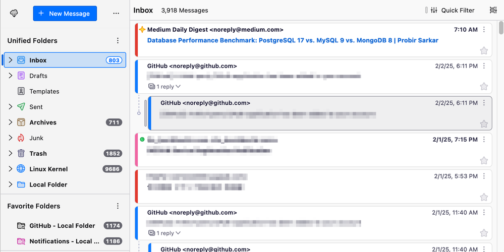
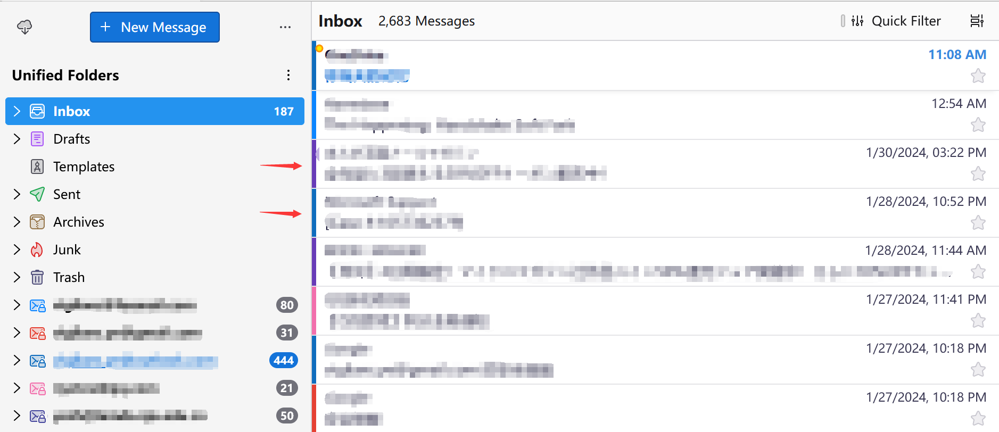
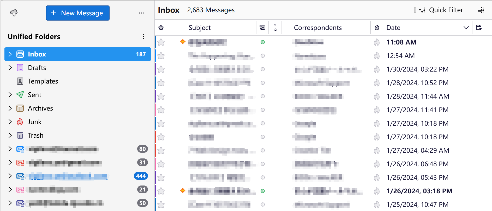
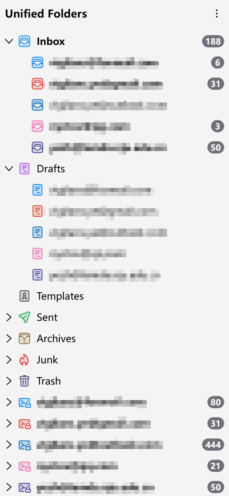
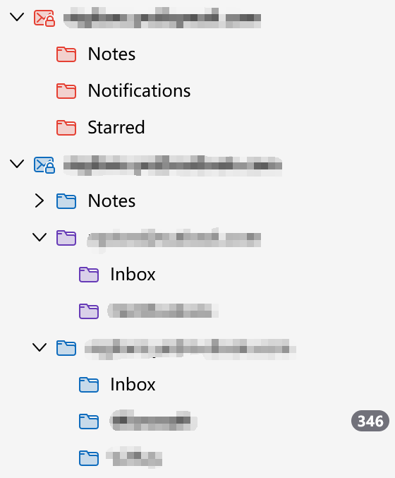
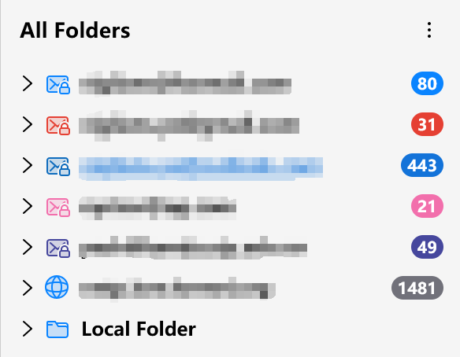
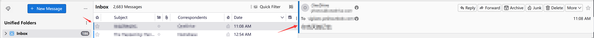
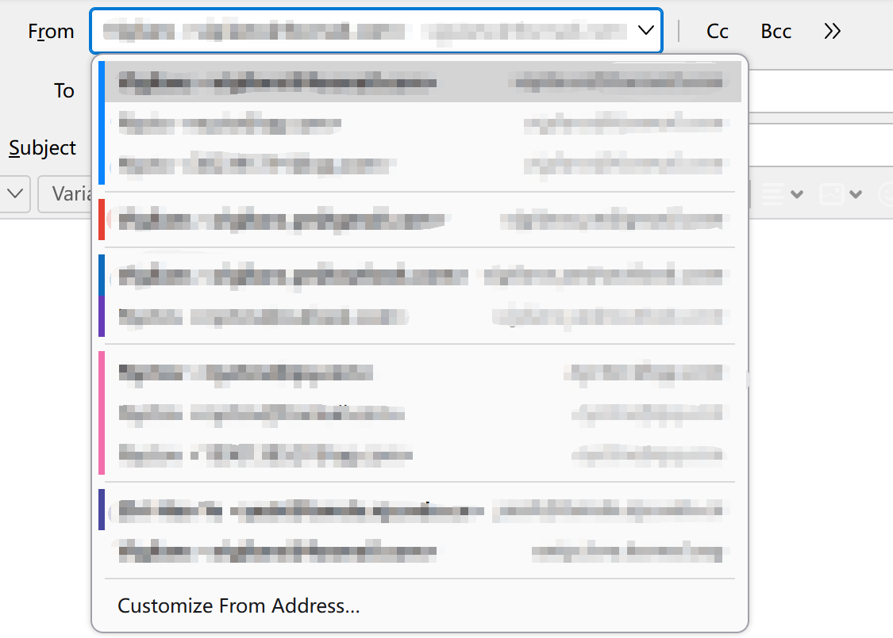

# Account Colors

Fork of the Account Colors add-on for Thunderbird

Continuation of the [account colours plugin](https://addons.thunderbird.net/en-us/thunderbird/addon/account-colors/) for modern thunderbird(s).

# New Features

## Thread Pane

### Color Row Background as Label in Card View

For each thread pane's card row, their background color will be rendered as a small label in the leftmost of the card.

* The label's width can be configured.
* The label's position can be set to be indented/not indented for thread submessages.

#### Thunderbird 128:

#### Thunderbird 115:

### Color Row Background as Label in Table View

For each thread pane's table row, their background color will be rendered as a small label in the leftmost of the column.

* The label's width can be configured.
* The label's position can be set to be at subject column, or at first column of the row.

## Folder Pane

### Render Account Background Color as Icon Color

For account folders, and all subfolders in each Unified Folders (Inbox, Draft, etc.), their background color will be rendered as folder icon's color.

### Render Folder Background Color as Icon Color

For normal folders, their background color will be rendered as foler icons color (The orange and blue ones).

* If any folder is named as one of its identity's email or name (the purple one), that folder and all its subfolders will be rendered with that identity's color.

### Color Unread / Total Background

The folder's unread / total messages badge's background can be colored now.

* It will not affect new message's background color.

## Message Pane

### Color Header Background as Label

Message header's background will be rendered as a small label in the leftmost area.

* The label's width can be configured.

## Compose Pane

### Color Identity Background as Label in From Menu

Identity entry's background will be rendered as a small label in the leftmost of the row.

* The label's width can be configured.

